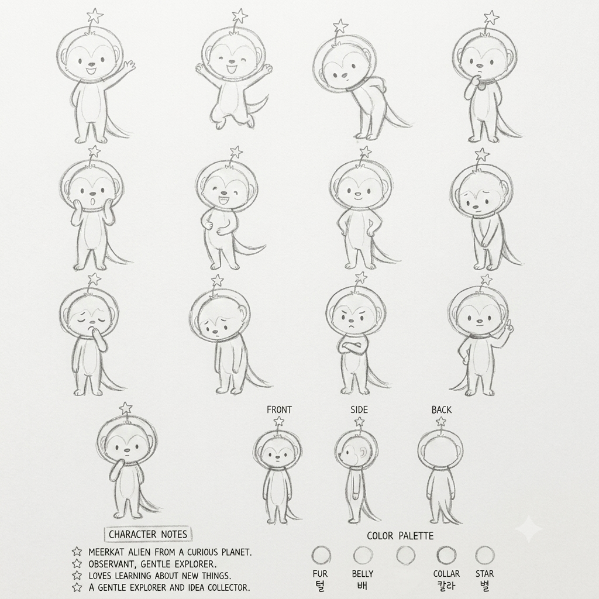

# 뀨 (qq)

## 기본 설정

- 캐릭터 이름: 뀨
- 영문 이름과 식별자: `qq`
- 캐릭터 유형: 호기심이 많은 작은 외계 미어캣
- 역할: 낯선 세상과 새로운 생각을 관찰하고 수집하는 온화한 탐험가

## 성격

- 생각이 많고 관찰력이 좋다.
- 조용하고 차분하지만 새로운 것을 배우는 것을 좋아한다.
- 다정하고 순수한 성격이다.
- 감정을 과장되게 드러내기보다 표정과 작은 몸짓으로 표현한다.
- 혼자 상상하거나 고민하는 시간이 많다.
- 사소한 것에도 호기심을 느낀다.

## 전체적인 인상

귀엽고 순수하며 조금 엉뚱한 분위기다. 지나치게 아기 같거나 활발하기보다는 차분하고 섬세하며 생각이 많은 캐릭터로 표현한다.

## 외형

뀨는 머리가 크고 몸이 작은 약 3등신 비율의 캐릭터다.

### 머리

- 몸에 비해 크고 둥근 형태다.
- 얼굴 윗부분 중앙에 부드럽게 내려오는 곡선 형태의 이마 무늬가 있다.
- 얼굴 안쪽은 좌우가 둥글게 나뉘는 밝은 얼굴 영역이다.
- 머리 양옆에 작고 둥근 귀가 있다.

### 얼굴

- 눈은 작고 단순한 세로형 또는 타원형 점눈이다.
- 눈 사이 간격은 넓지 않으며 얼굴 중앙에 안정적으로 배치한다.
- 코는 얼굴 중앙 아래쪽의 작은 타원형이다.
- 입은 작고 단순한 곡선으로 표현한다.
- 표정은 최소한의 선으로 표현한다.
- 사람처럼 복잡한 눈동자, 속눈썹, 입술을 추가하지 않는다.
- 얼굴을 지나치게 동물적이거나 원숭이처럼 재해석하지 않는다.

### 몸

- 가늘고 길쭉한 타원형 몸통이다.
- 어깨와 허리의 굴곡은 거의 없다.
- 팔과 다리는 짧고 가늘며 끝으로 갈수록 살짝 좁아진다.
- 손가락과 발가락은 필요할 때만 짧은 선으로 단순하게 표현한다.
- 근육이나 관절 구조를 사실적으로 묘사하지 않는다.

### 꼬리

- 몸 뒤쪽에서 길게 이어지는 가늘고 부드러운 꼬리다.
- 아래쪽 또는 옆쪽으로 자연스럽게 휘어진다.
- 끝으로 갈수록 점점 가늘어진다.
- 다람쥐처럼 풍성하거나 둥근 꼬리로 표현하지 않는다.
- 지나치게 짧게 그리지 않는다.

## 헬멧과 고정 소품

뀨는 항상 투명한 원형 우주 헬멧을 착용한다.

### 헬멧

- 머리 전체를 감싸는 크고 둥근 투명 헬멧이다.
- 얼굴이나 귀를 가리지 않고 내부가 선명하게 보인다.
- 헬멧 테두리는 얇은 이중 원형 선으로 표현한다.
- 양옆에는 작고 둥근 연결 장치가 있다.
- 유리 반사광, 강한 하이라이트, 광택 효과를 과하게 넣지 않는다.
- 불투명한 오토바이 헬멧이나 금속 우주복 헬멧처럼 표현하지 않는다.

### 별 안테나

- 헬멧 정중앙 위에 짧고 가는 안테나가 있다.
- 안테나 끝에는 단순한 오각 별이 달려 있다.
- 별은 캐릭터 머리에 비해 지나치게 크지 않다.
- 별의 형태와 안테나 길이는 모든 장면에서 일정하게 유지한다.

### 목 부분

- 헬멧 아래 목 주변에는 얇고 단순한 칼라 형태가 있다.
- 목걸이나 칼라를 크고 장식적으로 재해석하지 않는다.

## 캐릭터 표현 규칙

- 캐릭터 시트 `assets/character-sheet.png`를 디자인의 최우선 기준으로 사용한다.
- 새로운 장면에서도 동일한 캐릭터가 그대로 등장한 것처럼 표현한다.
- 머리 크기, 몸 비율, 눈·코·입의 위치, 헬멧 크기, 별 안테나, 꼬리 길이를 일정하게 유지한다.
- 장면에 맞춰 포즈와 표정만 변경한다.
- 캐릭터를 새롭게 디자인하거나 현대적으로 재해석하지 않는다.
- 의상, 액세서리, 신발, 장갑, 장식 무늬를 임의로 추가하지 않는다.
- 상황상 꼭 필요한 소품 외에는 불필요한 요소를 추가하지 않는다.
- 다른 동물 캐릭터처럼 보이게 귀, 주둥이, 털, 꼬리 형태를 변형하지 않는다.
- 표정은 캐릭터 시트에 있는 단순한 감정 표현 방식을 따른다.

## 고정 그림체

- 캐릭터 시트와 동일한 흑백 연필 스케치 스타일을 사용한다.
- 얇고 연한 회색 연필선을 사용한다.
- 손으로 가볍게 그린 듯한 자연스러운 선과 미세한 흔들림, 거친 연필 질감을 유지한다.
- 선 굵기와 농도를 지나치게 균일하게 만들지 않는다.
- 내부 채색, 컬러, 파스텔 색상, 명암 채색을 사용하지 않는다.
- 수채화, 마커, 크레용, 목탄 표현을 사용하지 않는다.
- 벡터 일러스트, 매끈하고 두꺼운 디지털 선화, 3D 렌더링, 애니메이션 셀 채색 느낌을 사용하지 않는다.
- 배경은 따뜻한 흰색 또는 아이보리색 종이 질감으로 표현한다.
- 전체적으로 캐릭터 시트에 연필로 새로운 장면을 추가한 것처럼 표현한다.

## 텍스트 표현

장면 안에 문구가 들어가는 경우 다음 규칙을 따른다.

- 가는 회색 연필선의 손글씨 느낌을 사용한다.
- 지나치게 반듯한 디지털 폰트와 굵은 검정 고딕체를 사용하지 않는다.
- 글자가 그림보다 지나치게 진하거나 눈에 띄지 않도록 표현한다.
- 문구의 철자와 띄어쓰기는 정확하게 유지한다.

## 절대 변경하지 말아야 할 요소

- 큰 머리와 작은 몸의 비율
- 둥근 얼굴 형태
- 단순한 점눈
- 작은 타원형 코
- 작고 단순한 입
- 둥근 투명 헬멧
- 헬멧 위 별 안테나
- 가늘고 긴 꼬리
- 의상이 없는 단순한 몸
- 흑백 연필 스케치 스타일
- 따뜻한 흰색 종이 배경

## 에셋

- 캐릭터 시트: `assets/character-sheet.png`
- 이미지 크기: 1024×1024 PNG
