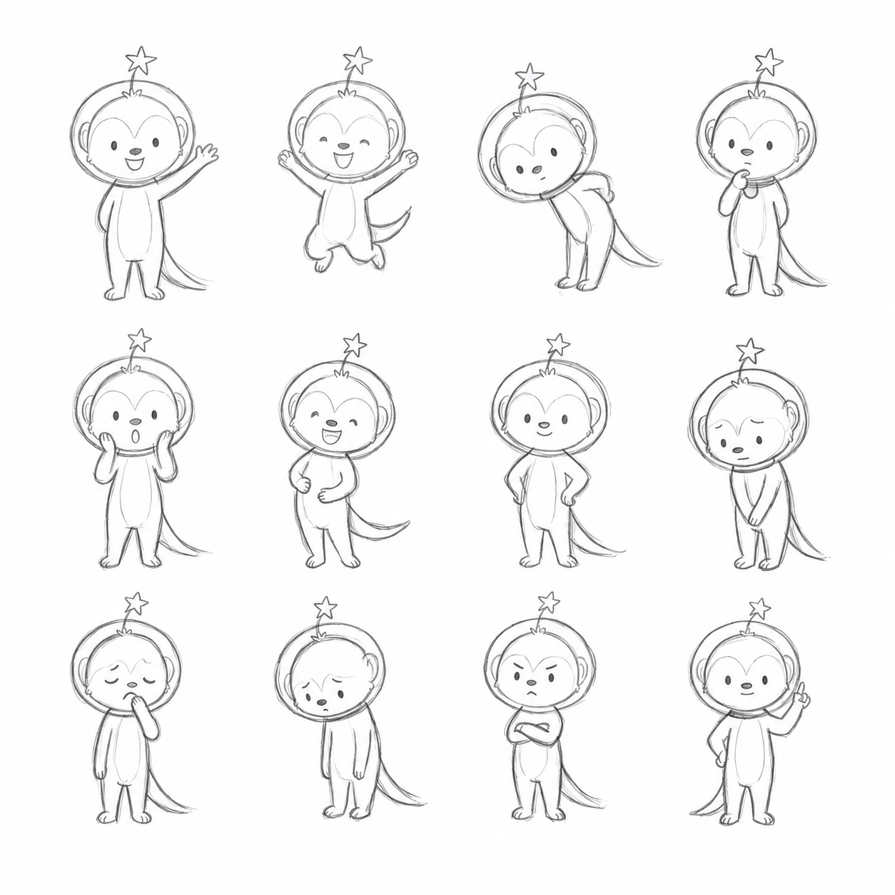
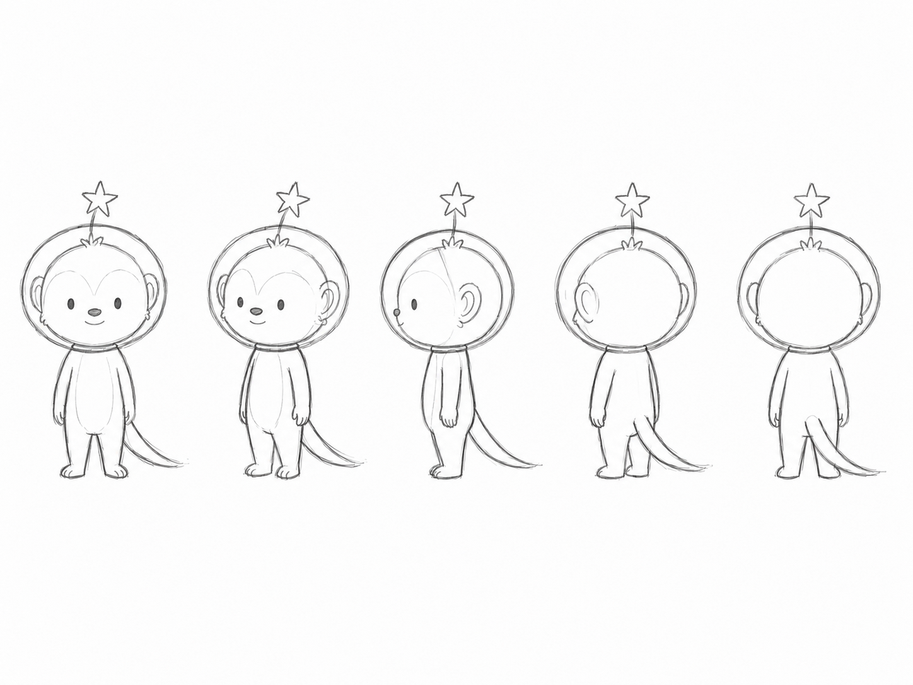

# 뀨 참조 및 표현 가이드

이 문서는 뀨를 새로운 장면에 일관되게 표현하기 위한 제작 규칙을 관리합니다. 캐릭터 자체의 설정은 `profile.md`를 기준으로 합니다.

## 기준 이미지

### 12가지 포즈

- 파일: `assets/pose-sheet.png`
- 크기: 1254×1254 PNG
- 용도: 표정, 감정, 자세와 작은 몸짓의 기준

### 턴어라운드

- 파일: `assets/turnaround-sheet.png`
- 크기: 1448×1086 PNG
- 용도: 정면부터 후면까지 방향별 외형, 신체 비율과 꼬리 위치의 기준

## 참조 우선순위

1. 포즈와 표정은 `pose-sheet.png`를 우선한다.
2. 방향별 외형과 비율은 `turnaround-sheet.png`를 우선한다.
3. 성격, 역할과 외형에 대한 문장 설명은 `profile.md`를 따른다.
4. 서로 충돌하는 결과가 나오면 기준 이미지에 더 가까운 쪽을 채택한다.

## 캐릭터 표현 규칙

- 새로운 장면에서도 동일한 캐릭터가 그대로 등장한 것처럼 표현한다.
- 머리 크기, 몸 비율, 눈·코·입의 위치, 헬멧 크기, 머리에서 시작하는 별 안테나와 꼬리 길이를 일정하게 유지한다.
- 장면에 맞춰 포즈와 표정만 변경한다.
- 캐릭터를 새롭게 디자인하거나 현대적으로 재해석하지 않는다.
- 의상, 액세서리, 신발, 장갑과 장식 무늬를 임의로 추가하지 않는다.
- 상황상 꼭 필요한 소품 외에는 불필요한 요소를 추가하지 않는다.
- 다른 동물 캐릭터처럼 보이게 귀, 주둥이, 털과 꼬리 형태를 변형하지 않는다.
- 표정은 포즈 시트에 있는 단순한 감정 표현 방식을 따른다.

## 세부 묘사 제한

- 사람처럼 복잡한 눈동자, 속눈썹과 입술을 추가하지 않는다.
- 얼굴을 지나치게 동물적이거나 원숭이처럼 재해석하지 않는다.
- 손가락과 발가락은 필요할 때만 짧은 선으로 단순하게 표현한다.
- 근육이나 관절 구조를 사실적으로 묘사하지 않는다.
- 꼬리를 다람쥐처럼 풍성하거나 둥글게 만들지 않고, 지나치게 짧게 그리지 않는다.
- 헬멧에 유리 반사광, 강한 하이라이트와 광택 효과를 과하게 넣지 않는다.
- 헬멧을 불투명한 오토바이 헬멧이나 금속 우주복 헬멧처럼 표현하지 않는다.
- 별 안테나의 시작점은 머리 정중앙으로 고정하고, 헬멧 표면에 부착된 장식처럼 표현하지 않는다.
- 머리에서 시작한 안테나가 투명 헬멧 상단 밖으로 자연스럽게 이어지도록 형태와 길이를 일정하게 유지한다.
- 목 부분의 칼라를 크고 장식적인 목걸이처럼 재해석하지 않는다.

## 고정 그림체

- 포즈 시트와 턴어라운드 시트에 사용된 흑백 연필 스케치 스타일을 유지한다.
- 얇고 연한 회색 연필선을 사용한다.
- 손으로 가볍게 그린 듯한 자연스러운 선과 미세한 흔들림, 거친 연필 질감을 유지한다.
- 선 굵기와 농도를 지나치게 균일하게 만들지 않는다.
- 내부 채색, 컬러, 파스텔 색상과 명암 채색을 사용하지 않는다.
- 수채화, 마커, 크레용과 목탄 표현을 사용하지 않는다.
- 벡터 일러스트, 매끈하고 두꺼운 디지털 선화, 3D 렌더링과 애니메이션 셀 채색 느낌을 사용하지 않는다.
- 배경은 따뜻한 흰색 또는 아이보리색 종이 질감으로 표현한다.
- 전체적으로 두 기준 시트에 연필로 새로운 장면을 추가한 것처럼 표현한다.

## 텍스트 표현

장면 안에 문구가 들어가는 경우 다음 규칙을 따른다.

- 가는 회색 연필선의 손글씨 느낌을 사용한다.
- 지나치게 반듯한 디지털 폰트와 굵은 검정 고딕체를 사용하지 않는다.
- 글자가 그림보다 지나치게 진하거나 눈에 띄지 않도록 표현한다.
- 문구의 철자와 띄어쓰기는 정확하게 유지한다.

## 생성 전 확인 목록

- [ ] 큰 머리와 작은 몸의 약 3등신 비율인가?
- [ ] 둥근 얼굴, 단순한 점눈, 작은 타원형 코와 작은 입을 유지했는가?
- [ ] 별 안테나가 헬멧 표면이 아니라 머리 정중앙에서 시작해 헬멧 위로 솟아 있는가?
- [ ] 꼬리가 가늘고 충분히 긴가?
- [ ] 임의의 의상이나 액세서리를 추가하지 않았는가?
- [ ] 흑백 연필 스케치와 따뜻한 흰색 종이 배경을 유지했는가?
